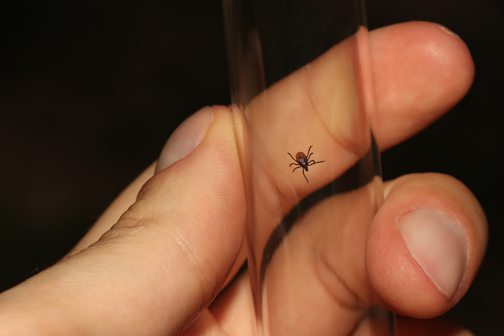

# Entomologist

Over 1.3 million insect species have been described, more than two-thirds of all known species. Some insect species date back to around 400 million years ago. They have many kinds of interactions with humans and other forms of life on Earth.

Entomology developed rapidly in the 19th and 20th centuries, and was studied by large numbers of people, including such notable figures as Charles Darwin, Jean-Henri Fabre, Vladimir Nabokov, Karl von Frisch (winner of the 1973 Nobel Prize in Physiology or Medicine), and two-time Pulitzer Prize winner E. O. Wilson.

There has also been a history of people becoming entomologists through museum curation and research assistance,

In 1994, the Entomological Society of America launched a new professional certification program for the pest control industry called the Associate Certified Entomologist (ACE). To qualify as a "true entomologist" an individual would normally require an advanced degree, with most entomologists pursuing a PhD. While not true entomologists in the traditional sense, individuals who attain the ACE certification may be referred to as ACEs or Associate Certified Entomologists.

Many entomologists specialize in a single order or even a family of insects, and a number of these subspecialties are given their own informal names, typically (but not always) derived from the scientific name of the group

<figure><figcaption></figcaption></figure>
