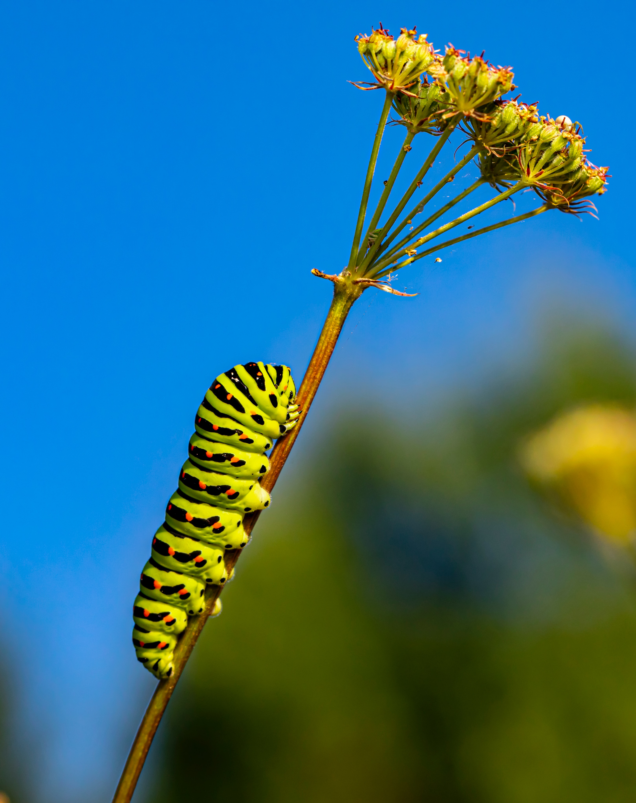

# caterpillar

Caterpillars have evolved defenses against physical conditions such as cold, hot or dry environmental conditions. Some Arctic species like Gynaephora groenlandica have special basking and aggregation behaviours

Some caterpillars regurgitate acidic digestive juices at attacking enemies. Many papilionid larvae produce bad smells from extrudable glands called osmeteria.

Many caterpillars display feeding behaviors which allow the caterpillar to remain hidden from potential predators. Many feed in protected environments, such as enclosed inside silk galleries, rolled leaves or by mining between the leaf surfaces.

Some caterpillars, like early instars of the tomato hornworm and tobacco hornworm, have long "whip-like" organs attached to the ends of their body. The caterpillar wiggles these organs to frighten away flies and predatory wasps.

Some caterpillars obtain protection by associating themselves with ants. The Lycaenid butterflies are particularly well known for this. They communicate with their ant protectors by vibrations as well as chemical means and typically provide food rewards.

